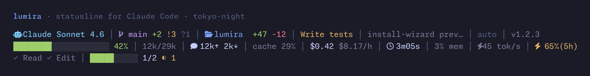
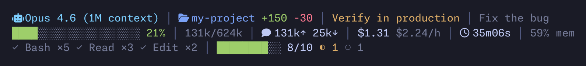
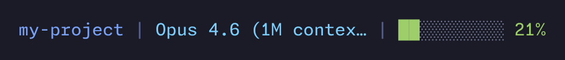
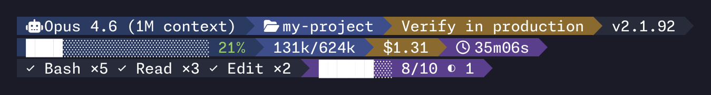
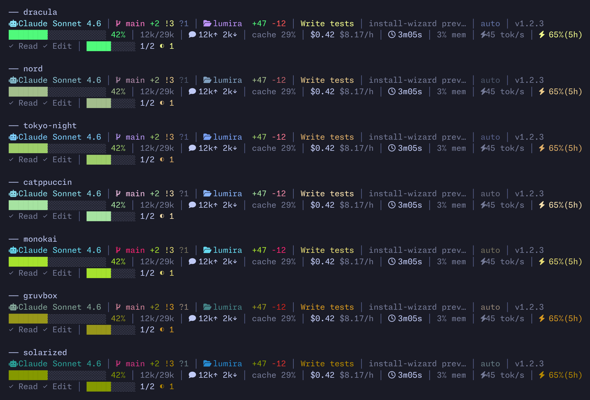
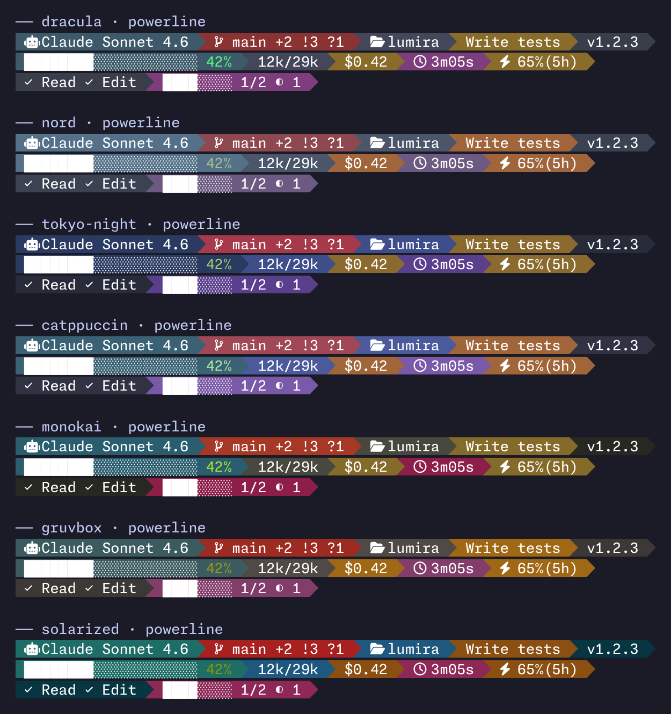

# lumira

Real-time statusline plugin for [Claude Code](https://code.claude.com) and Qwen Code.



[](https://asciinema.org/a/apvjkloigO9hrdVA)

## Quick start

```bash
npx lumira install
```

Interactive wizard — preset, theme, icons — previewed live before write.

[](https://www.npmjs.com/package/lumira)
[](https://www.npmjs.com/package/lumira)
[](LICENSE)


[](https://github.com/cativo23/lumira/actions/workflows/ci.yml)


> 🚀 Powering hundreds of Claude Code sessions per week — [share yours](https://github.com/cativo23/lumira/discussions) in Discussions.

## Table of contents

- [Why lumira?](#why-lumira)
- [Requirements](#requirements)
- [Features](#features)
- [Install](#install)
- [Display modes](#display)
- [Themes](#themes)
- [Powerline](#powerline)
- [Configuration](#configuration)
- [Architecture](#architecture)
- [Development](#development)
- [Contributing](#contributing)
- [License](#license)

## Why lumira?

Claude Code's default statusline shows the model name and current directory. That's it. Lumira surfaces what actually changes during a session and what you'd want to react to:

- **Context-window pressure** — color-coded bar from green to blinking red, with a `/compact?` hint at high fill so you act before hitting the wall.
- **Burn rate** — `$/h` next to total cost, so a runaway agent shows up immediately.
- **Rate-limit countdown** — 5h/7d usage with reset countdown, so you stop guessing how much budget you have left.
- **Active tools, agents, and todo progress** — parsed from the live transcript, updated every render.
- **Cross-platform** — same config drives Claude Code and Qwen Code; Qwen sessions auto-collapse to single-line.

Inspired by [claude-hud](https://github.com/jarrodwatts/claude-hud); takes a different stance on opt-in powerline rendering, theme contrast guarantees, and hyperlinked metadata.

## Requirements

- **Node ≥18**
- **Nerd Font** (recommended) — for the `` `` `` `` ``◐`` icons throughout the statusline. Falls back to plain glyphs via `icons: emoji` or `icons: none`.
- **Truecolor terminal** (for themes / powerline) — auto-detected via `COLORTERM=truecolor`. 256-color terminals get a nearest-index projection; named-ANSI terminals fall back to default colors silently.

## Features

- **Context bar with thresholds** — green → yellow → orange → blinking red, plus an actionable `/compact?` hint when fill is high.
- **Powerline mode** + 7 separator presets (`arrow`, `flame`, `slant`, `round`, `diamond`, `compatible`, `plain`) across 3 lines.
- **OSC 8 hyperlinks** — clickable directory and version tag on iTerm2, WezTerm, Kitty, VS Code, Alacritty.
- **7 hand-curated themes** — `dracula`, `nord`, `tokyo-night`, `catppuccin`, `monokai`, `gruvbox`, `solarized`. WCAG AA contrast guaranteed in CI.
- **Token + cost metrics** — input/output counts, speed (tok/s), $ total + burn rate ($/h).
- **Auto-fits at <70 cols** — switches from 3-line custom mode to single-line minimal automatically.
- **Zero runtime dependencies** — Node 18+ only.
- **Dual-platform** — Claude Code and Qwen Code share the same config.

<details>
<summary>Everything else lumira shows</summary>

- **Git status** — branch + staged/modified/untracked counts, 5s TTL cache. Branch turns red on dirty repos in powerline mode.
- **Rate limits** — 5h/7d usage with color warnings and reset countdown.
- **Active agents** — running subagent count and types from the transcript.
- **GSD integration** — current task and update notifications (opt-in).
- **Config health widget** — surfaces silent fallbacks (theme/powerline degrading in named-ANSI, missing GSD STATE.md). Opt-in.
- **Memory usage** — process RSS percentage.
- **MCP server detection** — count of attached MCP servers per session.
- **Vim-mode hint, thinking effort, worktree, output style, session name** — all togglable per-field via `display.*`.
- **3-tier color system** — named ANSI / 256-color / truecolor, auto-detected.
- **Config-driven** — every feature toggleable via JSON config + CLI flags.

</details>

## Install

The wizard at the top is the fastest path. For the long form:

```bash
npx lumira install
```

The installer walks you through three choices — **preset** (`full` / `balanced` / `minimal`), **theme**, and **icons** — showing a live preview at each step. Press `Esc` to abort without writing anything. In non-interactive shells (piped stdin, CI), the installer skips the wizard and writes sensible defaults (`preset: balanced`, `icons: nerd`). If Qwen Code is detected (`~/.qwen/` exists), the `/lumira` skill is installed for both CLIs.

Or install globally:

```bash
npm install -g lumira
lumira install
```

To uninstall:

```bash
npx lumira uninstall
```

Your preferences are saved to `~/.config/lumira/config.json` — hand-edited keys (e.g. custom `display` toggles) are preserved on re-install.

### Manual setup

Add to `~/.claude/settings.json`:

```json
{
  "statusLine": {
    "type": "command",
    "command": "npx lumira@latest",
    "padding": 0
  }
}
```

If installed from source:

```json
{
  "statusLine": {
    "type": "command",
    "command": "node /path/to/lumira/dist/index.js",
    "padding": 0
  }
}
```

## Display

### Custom Mode (default, >=70 columns)



### Minimal Mode (<70 columns or `--minimal`)



### Powerline Mode (opt-in via `style: "powerline"`)



Each segment renders with a distinct background color drawn from the active theme; segments are separated by a Nerd Font glyph (default ``). On dirty git repos the branch segment turns red. Falls back to classic mode silently in named-ANSI terminals (powerline needs RGB backgrounds). See [Powerline](#powerline) below for the 7 separator styles.

## Themes

Seven hand-curated themes, every one tested for WCAG AA contrast against white foreground in CI. Themes apply to both classic and powerline modes:

`dracula` · `nord` · `tokyo-night` · `catppuccin` · `monokai` · `gruvbox` · `solarized`

**Classic mode** — pipe-separated layout, theme colors applied to text:



**Powerline mode** — colored segment backgrounds with arrow separators:



Themes apply in truecolor and 256-color terminals; named-ANSI terminals fall back to default colors (8 base hues can't represent arbitrary palettes).

### Browse from the CLI

Try a theme without touching your config:

```bash
lumira themes                                # list all themes
lumira themes preview tokyo-night            # render a sample
lumira themes preview nord --powerline       # same in powerline (default arrow separator)
lumira themes preview gruvbox --style=flame  # powerline with flame separator
lumira themes preview --all                  # render every theme in sequence
lumira themes preview --all --powerline      # the powerline grid (great for screenshots)
```

### Want your favorite theme?

Adding a theme is a single new file plus a one-line registration. Every PR runs the **WCAG AA contrast guard** — if any powerline cell drops below 4.5:1 against the foreground, CI rejects it. See [CONTRIBUTING.md → Adding a theme](CONTRIBUTING.md#adding-a-theme) for the walkthrough.

## Powerline

`style: "powerline"` (or `--powerline`) renders the statusline with colored segment backgrounds and glyph separators inspired by powerline-go / oh-my-posh. Available separator presets via `powerline.style` (or `--powerline-style=<name>`):

| Style | Look |
|---|---|
| `arrow` | classic right-pointing triangle separator (default) |
| `flame` | wavy flame-shaped separator |
| `slant` | forward-slanting separator |
| `round` | rounded caps at line ends + thin internal separators |
| `diamond` | each segment isolated as its own pill with rounded caps |
| `compatible` | unicode `▶` separator (no Nerd Font required) |
| `plain` | no separator glyphs — just colored blocks |
| `auto` | picks `arrow` if Nerd Font icons are configured, else `compatible` |

### Hyperlinks (OSC 8)

The directory on line 1 becomes a clickable `file://` link, and the version tag links to its npm release page on terminals that support [OSC 8](https://gist.github.com/egmontkob/eb114294efbcd5adb1944c9f3cb5feda) (iTerm2, WezTerm, Kitty, Alacritty, VS Code terminal, tmux ≥3.4 with passthrough). Other terminals show plain text. Auto-disabled in `Apple_Terminal` (which leaks markers) and `TERM=dumb`.

```bash
NO_HYPERLINKS=1 claude    # disable
FORCE_HYPERLINK=1 claude  # force-enable (overrides denylist)
```

### Qwen Code

Lumira auto-detects the platform. In Qwen Code sessions, the renderer automatically switches to single-line output regardless of your configured layout — Qwen only displays the first statusline row, so lumira fits everything (model, branch, context bar, cost, cached tokens, thoughts) into one line. **No configuration needed:** the same `config.json` serves both Claude Code and Qwen Code.

## Configuration

Create `~/.config/lumira/config.json`:

```json
{
  "preset": "balanced",
  "theme": "tokyo-night",
  "icons": "nerd",
  "style": "classic",
  "powerline": { "style": "auto" },
  "gsd": false,
  "colors": { "mode": "auto" },
  "display": {
    "model": true,
    "branch": true,
    "gitChanges": true,
    "directory": true,
    "contextBar": true,
    "contextTokens": true,
    "tokens": true,
    "cacheMetrics": true,
    "cost": true,
    "burnRate": true,
    "duration": true,
    "tokenSpeed": true,
    "rateLimits": true,
    "tools": true,
    "todos": true,
    "mcp": true,
    "vim": true,
    "effort": true,
    "worktree": true,
    "agent": true,
    "sessionName": true,
    "style": true,
    "version": true,
    "linesChanged": true,
    "memory": true,
    "health": false
  }
}
```

All fields are optional — defaults are shown above. `display.health` defaults to `false` (opt-in widget).

### CLI Flags

```bash
lumira --minimal                    # Force single-line mode
lumira --balanced                   # Force balanced preset
lumira --full                       # Force full multi-line preset
lumira --gsd                        # Enable GSD integration
lumira --powerline                  # Enable powerline visual style
lumira --classic                    # Force classic (pipe-separated) line 1
lumira --powerline-style=arrow      # Pick separator: arrow|flame|slant|round|diamond|compatible|plain|auto
lumira --icons=nerd|emoji|none      # Override icon set
lumira --preset=full|balanced|minimal
```

## Architecture

```text
stdin (JSON from Claude Code or Qwen Code)
  → normalize() — unifies both platform payloads
  → parsers (git, transcript, token-speed, memory, gsd)
  → RenderContext
  → render (line1-4 or minimal)
  → stdout
```

- **Dependency injection** for testability
- **File caching** — TTL-based (git, speed) and mtime-based (transcript)
- **Progressive truncation** — adapts to terminal width

## Development

```bash
npm run dev          # Watch mode (tsc --watch)
npm test             # Run tests
npm run test:watch   # Watch mode
npm run test:coverage # With coverage
npm run lint         # Type check
npm run build        # Compile to dist/
```

### Debugging

Set `LUMIRA_DEBUG=1` to trace parser decisions on stderr — cache hits, GSD state-file resolution, MCP server loads. Useful when investigating "why doesn't X show up?" reports. Stdout stays clean so it doesn't corrupt the statusline.

```bash
LUMIRA_DEBUG=1 claude    # or export LUMIRA_DEBUG=1
```

## Contributing

PRs welcome — particularly for new themes (one of the most common contribution paths). See [CONTRIBUTING.md](CONTRIBUTING.md) for the gitflow, theme submission walkthrough, and the contrast-guard CI step that runs on every theme PR.

### What's next

- **v0.7.0** — additional themes from the community, expanded `lumira themes` subcommand surface.
- **v1.0** — locked CLI flags surface, snapshot tests for layout regression, soak window before tagging stable. Tracked in [issue #36](https://github.com/cativo23/lumira/issues/36).
- **Backlog** — incremental transcript parsing for very large sessions ([PR #46](https://github.com/cativo23/lumira/pull/46), deferred until parser hardening lands).

For security issues, see [SECURITY.md](SECURITY.md).

## Credits

Inspired by [claude-hud](https://github.com/jarrodwatts/claude-hud). Migrated from [claude-setup](https://github.com/cativo23/claude-setup) statusline.

Theme palettes drawn from upstream specs: [Dracula](https://draculatheme.com), [Nord](https://www.nordtheme.com), [Tokyo Night](https://github.com/folke/tokyonight.nvim), [Catppuccin](https://catppuccin.com), [Monokai](https://monokai.pro), [Gruvbox](https://github.com/morhetz/gruvbox), [Solarized](https://ethanschoonover.com/solarized).

## License

MIT © [Carlos Cativo](https://github.com/cativo23) — see [LICENSE](LICENSE) for the full text.
