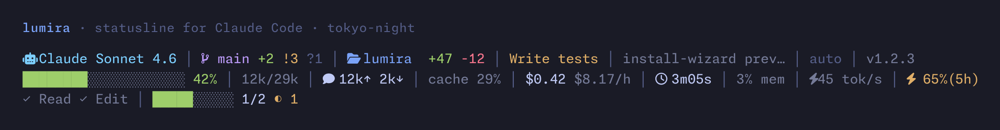
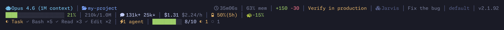
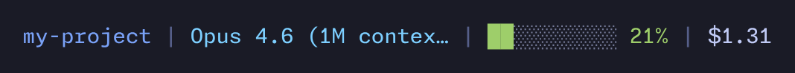
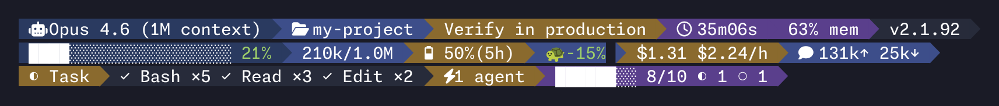
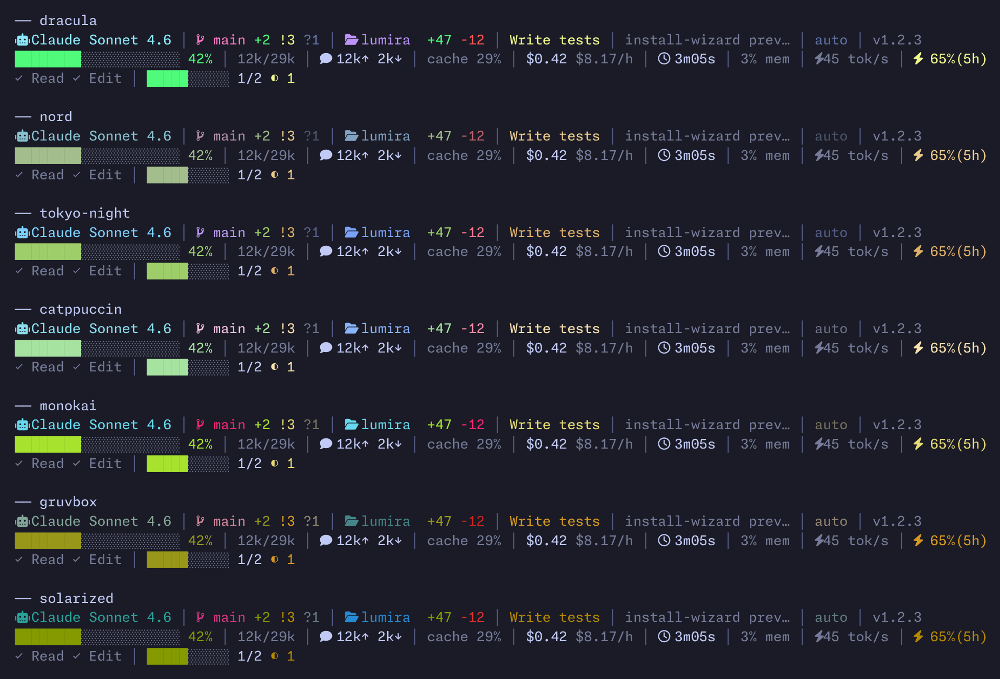
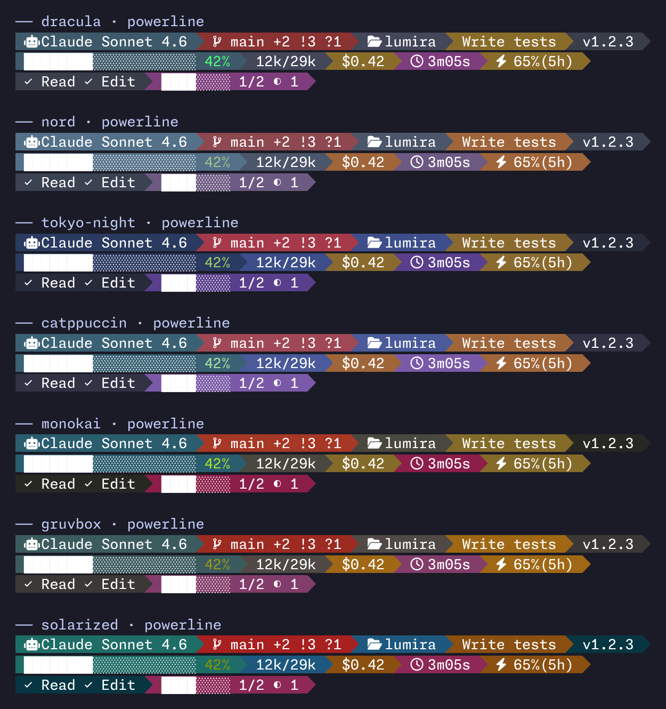

# lumira

Real-time statusline plugin for [Claude Code](https://code.claude.com) and Qwen Code.



[](https://asciinema.org/a/apvjkloigO9hrdVA)

## Quick start

**Via Claude Code plugin (recommended):**

```
/plugin marketplace add cativo23/lumira
/lumira:setup
```

No npm required. The `/lumira:setup` skill writes `statusLine.command` automatically. Restart Claude Code when done.

**Via npm:**

```bash
npx lumira install
```

Interactive wizard — preset, theme, icons — previewed live before write.

[](https://www.npmjs.com/package/lumira)
[](https://www.npmjs.com/package/lumira)
[](LICENSE)


[](https://github.com/cativo23/lumira/actions/workflows/ci.yml)


> **What's new in v1.9.0:** lumira is now a **Claude Code plugin** — install with `/plugin marketplace add cativo23/lumira`, no npm required. Run `/lumira:setup` to activate. v1.8.2 made the installer write a fast per-render command (~10× faster). v1.8.1 brought the GSD widget to parity with GSD 1.42.3. Earlier: compaction counter `⊙ N` (v1.8.0), added-dirs badge + worktree breadcrumb (v1.7.0), [`lumira stats` CLI](#stats-cli) (v1.5), `API N%` latency widget (v1.4.0), 7-day quota projection (v1.3.0).

## Table of contents

- [Why lumira?](#why-lumira)
- [How lumira compares](#how-lumira-compares)
- [Requirements](#requirements)
- [Features](#features)
- [Install](#install)
- [Display modes](#display)
- [Themes](#themes)
- [Stats CLI](#stats-cli)
- [Powerline](#powerline)
- [Configuration](#configuration)
- [Architecture](#architecture)
- [Development](#development)
- [Contributing](#contributing)
- [License](#license)

## Why lumira?

Claude Code's default statusline shows the model name and current directory. That's it. Lumira surfaces what actually changes during a session and what you'd want to react to:

- **Context-window pressure** — color-coded bar from green to blinking red, with a `/compact?` hint at high fill so you act before hitting the wall.
- **Burn rate** — `$/h` next to total cost, so a runaway agent shows up immediately.
- **Rate-limit battery** — 5h/7d usage shows as a Nerd Font battery glyph (or 🔋/🪫 in emoji mode) that fills as you consume quota, with a reset countdown above 70%. Hidden below 50% to keep the line uncluttered when you have margin.
- **Active tools, agents, and todo progress** — parsed from the live transcript, updated every render.
- **Cross-platform** — same config drives Claude Code and Qwen Code; Qwen sessions auto-collapse to single-line.

Inspired by [GSD's](https://github.com/open-gsd/gsd-core) statusline; takes its own stance on opt-in powerline rendering, theme contrast guarantees, and Qwen Code compatibility.

## How lumira compares

The Claude Code statusline space has several good tools. Here's an honest head-to-head on **features** against the other true statuslines (feature claims checked against each tool's current README, 2026-06-14):

| Tool | Runtime / deps | Distribution | Platforms | Config UX | Powerline + themes | Session-intel widgets |
|---|---|---|---|---|---|---|
| **lumira** | TS / **0 runtime deps** | npm + npx + plugin (+ Qwen skill) | **Claude Code + Qwen Code** | Wizard + JSON + CLI flags | Yes (7 styles) + 7 themes, **WCAG-AA guard** | **Quota projection, pace delta, API-latency, auto-compact glyph + counter, cache, agents, MCP, todos, tools** + `stats` CLI |
| ccstatusline | TS / bundled | npm + npx | Claude Code | **Ink TUI** (live preview) | Yes + themes | Context, cost, usage %, block timer, compaction count, git; no quota/pace/latency |
| claude-hud | JS / Node 18+ | Plugin marketplace | Claude Code (v1.0.80+) | Guided `/configure` + JSON | No / no themes | Context, 5h/7d usage, cost, git, tools, agents, todos, cache TTL; no quota ETA/pace/latency |
| CCometixLine | Rust binary | npm + binary + source | Claude Code | TUI (TOML) | Yes + themes | Model, dir, git, context %, usage, cost, time, output-style |
| claude-pace | Bash + jq | curl + plugin + npx | Claude Code 2.1.80+ | JSON block | No / no | 5h+7d %, pace delta, reset countdown, git diff; ~10ms (lightest) |
| cship | Rust binary | binary / script / cargo | Claude Code | TOML (Starship-style) | Yes (Starship) + themes | Cost, context bar, usage limits, model, effort, agent, session, peak-time |
| starship-claude | Shell / needs Starship | Plugin + manual | Claude Code (no tmux) | Wizard + TOML | Via Starship + palettes | Context bar, model, session |

**Where lumira leads:** breadth of session-intelligence widgets — sole owner of an API-latency widget, a 7-day quota *projection ETA*, an MCP-server count, and a bundled `stats` analytics CLI, on top of the full pace / agents / todos / cache set. Plus zero runtime deps, dual-platform (Claude Code **and** Qwen Code), and WCAG-AA contrast enforced in CI on every theme. **Where it doesn't:** no Ink-style interactive widget builder — config is a wizard + JSON, not a live drag-and-drop TUI.

See [`docs/competitive-comparison.md`](docs/competitive-comparison.md) for the full per-widget matrix, config-UX detail, and distribution breakdown across every tool.

## Requirements

- **Node ≥18**
- **Nerd Font** (recommended) — for branch, folder, model, and spinner icons. Falls back to plain glyphs via `icons: emoji` or `icons: none`.
- **Truecolor terminal** (for themes / powerline) — auto-detected via `COLORTERM=truecolor`. 256-color terminals get a nearest-index projection; named-ANSI terminals fall back to default colors silently.

## Features

- **Context bar with thresholds** — green → yellow → orange → blinking red, plus an actionable `/compact?` hint when fill is high.
- **Session intelligence** — pace delta (🐢/🏎️) shows whether you're burning quota faster than the time window allows, with ETA when ahead of pace. Live agent count and cache hit rate round it out.
- **Powerline mode** + 7 separator presets (`arrow`, `flame`, `slant`, `round`, `diamond`, `compatible`, `plain`) across 3 lines.
- **OSC 8 hyperlinks** — clickable directory and version tag on iTerm2, WezTerm, Kitty, VS Code, Alacritty.
- **7 hand-curated themes** — `dracula`, `nord`, `tokyo-night`, `catppuccin`, `monokai`, `gruvbox`, `solarized`. WCAG AA contrast guaranteed in CI.
- **Token + cost metrics** — input/output counts, speed (tok/s), $ total + burn rate ($/h), cache hit rate.
- **Auto-fits at <70 cols** — switches from 3-line custom mode to single-line minimal automatically.
- **Zero runtime dependencies** — Node 18+ only.
- **Dual-platform** — Claude Code and Qwen Code share the same config.

<details>
<summary>Everything else lumira shows</summary>

- **Git status** — branch + staged/modified/untracked counts, 5s TTL cache. Branch turns red on dirty repos in powerline mode.
- **Rate limits** — 5h/7d usage as a battery glyph (Nerd Font level fill, or 🔋/🪫 in emoji mode) with color tier and reset countdown. Threshold-gated at 50% to stay invisible while you have margin.
- **Pace delta** — `usedPct − elapsedPct` of the 5h window. Turtle when behind pace (healthy), car with time-to-exhaustion when ahead. Color escalates green → yellow → orange → blinkRed. Toggle independently via `display.paceDelta`.
- **7d quota projection** — when the current burn rate would exhaust the 7d quota before the window resets, the 7d segment grows a warning: `⚠ ~24h`, `⚠ ~2d`, `⚠ Tue`, or `🔥 ~8h` (critical icon under 12h). Default on. Toggle via `display.quotaProjection`; off in the `minimal` preset. Different from pace delta — pace looks backwards at the 5h window's actual vs proportional burn, projection looks forwards at the 7d window's exhaustion ETA.
- **Active agents** — live count of running subagents (`⚡N agents`) plus types parsed from the transcript. Toggle via `display.agents`.
- **Cache hit rate** — prompt cache efficiency for the current turn (`87%⚡`). Alarm-mode: hidden while ≥90% (Anthropic's prompt cache pins this near 99% in healthy steady state, so an always-on number is wallpaper, not signal). Surfaces as yellow/orange/blinkRed only when the cache is actually degrading. Same hide-when-healthy pattern as rate-limits and agent count.
- **GSD integration** — current task and update notifications (opt-in).
- **Config health widget** — surfaces silent fallbacks (theme/powerline degrading in named-ANSI, missing GSD STATE.md). Opt-in.
- **Memory usage** — process RSS percentage.
- **MCP server detection** — count of attached MCP servers per session.
- **Vim-mode hint, thinking effort, worktree, output style, session name, added-dirs badge, worktree origin-branch breadcrumb** — all togglable per-field via `display.*`.
- **3-tier color system** — named ANSI / 256-color / truecolor, auto-detected.
- **Config-driven** — every feature toggleable via JSON config + CLI flags.

</details>

## Install

### Option 1 — Claude Code plugin (recommended)

No npm required. Works with the Claude Code plugin marketplace:

```
/plugin marketplace add cativo23/lumira
/lumira:setup
```

`/lumira:setup` finds the cached binary, writes `statusLine.command` to `~/.claude/settings.json`, and creates a default config. Restart Claude Code when done. To customize afterward: `/lumira:lumira`.

### Option 2 — npm

```bash
npx lumira install
```

The installer walks you through **preset** (`full` / `balanced` / `minimal`), **theme**, and **icons** — showing a live preview at each step. Press `Esc` to abort without writing anything. In non-interactive shells (piped stdin, CI), the installer skips the wizard and writes sensible defaults (`preset: balanced`, `icons: nerd`). If Qwen Code is detected (`~/.qwen/` exists), the `/lumira` skill is installed for both CLIs.

For the fastest statusline (the command runs on **every** render), the installer offers to install lumira globally so it can invoke the compiled binary directly (`lumira`, ~60ms) instead of `npx` (~10× slower). It also migrates older `npx lumira@latest` setups to the faster form automatically.

Or install globally:

```bash
npm install -g lumira
lumira install
```

To uninstall:

```bash
npx lumira uninstall
```

Your preferences are saved to `~/.config/lumira/config.json` — hand-edited keys (e.g. custom `display` toggles) are preserved on re-install.

### Manual setup

The `statusLine.command` runs on every render, so prefer the **direct binary**. Install globally (`npm install -g lumira`), then add to `~/.claude/settings.json`:

```json
{
  "statusLine": {
    "type": "command",
    "command": "lumira",
    "padding": 0
  }
}
```

If installed from source, point at the compiled entry:

```json
{
  "statusLine": {
    "type": "command",
    "command": "node /path/to/lumira/dist/index.js",
    "padding": 0
  }
}
```

> Without a global install you can use `"command": "npx lumira"` — it works, but resolves through npx on every render (~10× slower). Avoid `npx lumira@latest`: the `@latest` hits the npm registry on every render.

## Display

### Custom Mode (default, >=70 columns)



### Minimal Mode (<70 columns or `--minimal`)



### Powerline Mode (opt-in via `style: "powerline"`)



Each segment renders with a distinct background color drawn from the active theme; segments are separated by a Nerd Font glyph (default ``). On dirty git repos the branch segment turns red. Falls back to classic mode silently in named-ANSI terminals (powerline needs RGB backgrounds). See [Powerline](#powerline) below for the 7 separator styles.

## Themes

Seven hand-curated themes, every one tested for WCAG AA contrast against white foreground in CI. Themes apply to both classic and powerline modes:

`dracula` · `nord` · `tokyo-night` · `catppuccin` · `monokai` · `gruvbox` · `solarized`

**Classic mode** — pipe-separated layout, theme colors applied to text:



**Powerline mode** — colored segment backgrounds with arrow separators:



Themes apply in truecolor and 256-color terminals; named-ANSI terminals fall back to default colors (8 base hues can't represent arbitrary palettes).

### Browse from the CLI

Try a theme without touching your config:

```bash
lumira themes                                # list all themes
lumira themes preview tokyo-night            # render a sample
lumira themes preview nord --powerline       # same in powerline (default arrow separator)
lumira themes preview gruvbox --style=flame  # powerline with flame separator
lumira themes preview --all                  # render every theme in sequence
lumira themes preview --all --powerline      # the powerline grid (great for screenshots)
```

### Want your favorite theme?

Adding a theme is a single new file plus a one-line registration. Every PR runs the **WCAG AA contrast guard** — if any powerline cell drops below 4.5:1 against the foreground, CI rejects it. See [CONTRIBUTING.md → Adding a theme](CONTRIBUTING.md#adding-a-theme) for the walkthrough.

## Stats CLI

`lumira stats` reads a Claude Code or Qwen Code transcript `.jsonl` and prints a one-shot analytics summary — session duration, total cost, token totals, cache hit rate, tool call frequency, and burn rate (`$/h`). Useful for post-session review, scripting, and CI dashboards.

```bash
# Just works — auto-discovers the newest transcript for the current cwd.
lumira stats
# Session: 2h 15m — $4.23 — 156k tokens — 87% cache
# Tools: Bash×45 Read×32 Write×18 Edit×12 Agent×8
# Burn: $1.88/h
```

**Auto-discovery:** with no flags, `lumira stats` derives the Claude Code project slug from `cwd` (`/home/me/proj` → `-home-me-proj`) and reads the newest `.jsonl` under `~/.claude/projects/<slug>/`. If the current directory has no matching project dir, it falls back to the globally most-recently-modified transcript under `~/.claude/projects/` and prints a notice to stderr ("reading most recent session from …") so JSON pipelines on stdout stay clean.

**Flags:**

- `--session-id <path-or-uuid>` — override auto-discovery. A path (anything containing `/` or ending in `.jsonl`) is used as-is. A bare uuid is resolved first under `~/.claude/projects/<cwd-slug>/<uuid>.jsonl`, then by scanning every project dir for that filename.
- `--no-color` — strip ANSI escapes (also honored when the `NO_COLOR` env var is set, per [no-color.org](https://no-color.org)).
- `--json` — emit the raw `SessionStats` object as pretty-printed JSON for `jq` / CI composability.

**Qwen Code sessions** are parsed the same way, but cost and burn-rate lines are suppressed when the transcript lacks usage blocks (`hasCostData: false` in the JSON output) — no misleading `$0.00`.

## Powerline

`style: "powerline"` (or `--powerline`) renders the statusline with colored segment backgrounds and glyph separators inspired by powerline-go / oh-my-posh. Available separator presets via `powerline.style` (or `--powerline-style=<name>`):

| Style | Look |
|---|---|
| `arrow` | classic right-pointing triangle separator (default) |
| `flame` | wavy flame-shaped separator |
| `slant` | forward-slanting separator |
| `round` | rounded caps at line ends + thin internal separators |
| `diamond` | each segment isolated as its own pill with rounded caps |
| `compatible` | unicode `▶` separator (no Nerd Font required) |
| `plain` | no separator glyphs — just colored blocks |
| `auto` | picks `arrow` if Nerd Font icons are configured, else `compatible` |

### Hyperlinks (OSC 8)

The directory on line 1 becomes a clickable `file://` link, and the version tag links to its npm release page on terminals that support [OSC 8](https://gist.github.com/egmontkob/eb114294efbcd5adb1944c9f3cb5feda) (iTerm2, WezTerm, Kitty, Alacritty, VS Code terminal, tmux ≥3.4 with passthrough). Other terminals show plain text. Auto-disabled in `Apple_Terminal` (which leaks markers) and `TERM=dumb`.

```bash
NO_HYPERLINKS=1 claude    # disable
FORCE_HYPERLINK=1 claude  # force-enable (overrides denylist)
```

### Qwen Code

Lumira auto-detects the platform. In Qwen Code sessions, the renderer automatically switches to single-line output regardless of your configured layout — Qwen only displays the first statusline row, so lumira fits everything (model, branch, context bar, cost, cached tokens, thoughts) into one line. **No configuration needed:** the same `config.json` serves both Claude Code and Qwen Code.

## Configuration

Create `~/.config/lumira/config.json`:

```json
{
  "preset": "balanced",
  "theme": "tokyo-night",
  "icons": "nerd",
  "style": "classic",
  "powerline": { "style": "auto" },
  "gsd": false,
  "colors": { "mode": "auto" },
  "display": {
    "model": true,
    "branch": true,
    "gitChanges": true,
    "directory": true,
    "contextBar": true,
    "contextTokens": true,
    "tokens": true,
    "cacheMetrics": true,
    "cost": true,
    "burnRate": true,
    "duration": true,
    "tokenSpeed": true,
    "apiLatency": true,
    "rateLimits": true,
    "paceDelta": true,
    "quotaProjection": true,
    "tools": true,
    "todos": true,
    "mcp": true,
    "vim": true,
    "effort": true,
    "worktree": true,
    "addedDirs": true,
    "worktreeBreadcrumb": true,
    "agent": true,
    "sessionName": true,
    "style": true,
    "version": true,
    "linesChanged": true,
    "memory": true,
    "agents": true,
    "compactionCount": true,
    "health": false,
    "contextWarningThreshold": 70,
    "contextCriticalThreshold": 85
  }
}
```

All fields are optional — defaults are shown above. `display.health` defaults to `false` (opt-in widget).

**Context bar thresholds** — `contextWarningThreshold` (default 70) and `contextCriticalThreshold` (default 85) control when the bar transitions through yellow/orange/red. Both are clamped to `[0, 100]` and `warning < critical` is required (invalid pairs fall back to defaults with a one-shot stderr warning). Lower them for earlier warnings, raise them if your workflow tolerates fuller buffers.

> **Migration note (post-0.7.1):** default color transitions shifted from `50/65/80` to `50/70/85`. The bar now stays yellow up to 70% (was 65%) and orange up to 85% (was 80%) before flashing red. To restore the previous behavior, set `"contextWarningThreshold": 65, "contextCriticalThreshold": 80` in your config.

### CLI Flags

```bash
lumira --minimal                    # Force single-line mode
lumira --balanced                   # Force balanced preset
lumira --full                       # Force full multi-line preset
lumira --gsd                        # Enable GSD integration
lumira --powerline                  # Enable powerline visual style
lumira --classic                    # Force classic (pipe-separated) line 1
lumira --powerline-style=arrow      # Pick separator: arrow|flame|slant|round|diamond|compatible|plain|auto
lumira --icons=nerd|emoji|none      # Override icon set
lumira --preset=full|balanced|minimal
```

## Custom Commands

User-defined shell commands rendered as statusline segments on any of the 4 lines. Disabled by default.

### Enable

```bash
lumira custom enable
```

### Configure

Add a `customCommands` block to `~/.config/lumira/config.json`:

```json
{
  "customCommands": {
    "enabled": true,
    "commands": [
      {
        "id": "git-status",
        "command": ["git", "status", "--short"],
        "label": "",
        "line": 1,
        "refreshMs": 5000,
        "onError": "hide"
      }
    ]
  }
}
```

**Key fields:**

| Field | Description |
|---|---|
| `id` | Unique identifier for the command |
| `command` | Argv array — no shell expansion, pipes, or redirects |
| `line` | Statusline line to render on (`1`–`4`) |
| `refreshMs` | Refresh interval in milliseconds (default: `5000`) |
| `label` | Optional prefix shown before the command output |
| `color` | Optional color override for the segment |
| `onError` | What to show on non-zero exit: `hide` (default), `placeholder`, `output`, or `stale` |
| `onTimeout` | What to show on timeout: same options as `onError`, defaults to `hide` |
| `timeoutMs` | Max execution time in ms (clamped to 2000) |
| `maxBytes` | Max stdout bytes captured (clamped to 4096) |
| `ansi` | Set `true` to pass through ANSI escape sequences from the command |

`command` must be an argv array (`["git", "status", "--short"]`). Shell strings with pipes or redirects are not supported — wrap them in a script if needed.

Output is cached with a TTL and refreshed in the background, so the hot render path never blocks on subprocess execution.

### CLI subcommands

```bash
lumira custom list          # list configured commands and their status
lumira custom enable        # enable the custom commands feature
lumira custom disable       # disable the custom commands feature
lumira custom test <id>     # run a command immediately and print its output
lumira custom logs          # show recent execution logs
```

## Architecture

```text
stdin (JSON from Claude Code or Qwen Code)
  → normalize() — unifies both platform payloads
  → parsers (git, transcript, token-speed, memory, gsd)
  → RenderContext
  → render (line1-4 or minimal)
  → stdout
```

- **Dependency injection** for testability
- **File caching** — TTL-based (git, speed) and mtime-based (transcript)
- **Progressive truncation** — adapts to terminal width

## Development

```bash
npm run dev          # Watch mode (tsc --watch)
npm test             # Run tests
npm run test:watch   # Watch mode
npm run test:coverage # With coverage
npm run lint         # Type check
npm run build        # Compile to dist/
```

### Debugging

Set `LUMIRA_DEBUG=1` to trace parser decisions on stderr — cache hits, GSD state-file resolution, MCP server loads. Useful when investigating "why doesn't X show up?" reports. Stdout stays clean so it doesn't corrupt the statusline.

```bash
LUMIRA_DEBUG=1 claude    # or export LUMIRA_DEBUG=1
```

## Contributing

PRs welcome — particularly for new themes (one of the most common contribution paths). See [CONTRIBUTING.md](CONTRIBUTING.md) for the branching model, theme submission walkthrough, and the contrast-guard CI step that runs on every theme PR.

### What's next

- **v1.0** — soak window on v0.7.x, then tagging stable. CLI flags, preset names, and config schema are considered frozen from this point.
- **Themes** — community theme contributions welcome via the theme PR template.
- **Backlog** — incremental transcript parsing for very large sessions (deferred; full re-parse stays under budget for real-world transcripts).

For security issues, see [SECURITY.md](SECURITY.md).

## Credits

Migrated from [claude-setup](https://github.com/cativo23/claude-setup) statusline.

Theme palettes drawn from upstream specs: [Dracula](https://draculatheme.com), [Nord](https://www.nordtheme.com), [Tokyo Night](https://github.com/folke/tokyonight.nvim), [Catppuccin](https://catppuccin.com), [Monokai](https://monokai.pro), [Gruvbox](https://github.com/morhetz/gruvbox), [Solarized](https://ethanschoonover.com/solarized).

## License

MIT © [Carlos Cativo](https://github.com/cativo23) — see [LICENSE](LICENSE) for the full text.
